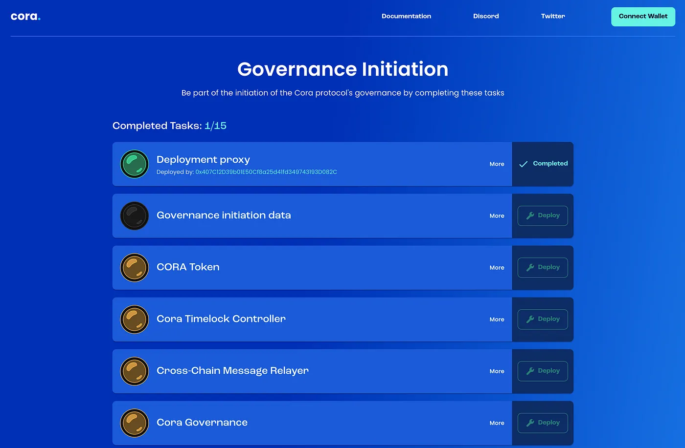

# Decentralized Governance Initiation

🚨 **Disclaimer:** I'm not a lawyer and if you want to launch your governance using this approach, I recommend consulting with a lawyer.

Inspired by [Tornado Cash's Governance Initiation](https://tornado-cash.medium.com/tornado-cash-governance-proposal-a55c5c7d0703)

This repository contains a community driven governance initiation set of smart contracts. The project is developed with Foundry + Hardhat. 

Most of the unit test are done using Foundry and some E2E scenarios with Hardhat. The project also contains some Hardhat tasks to generate the file required by the UI.

Essentially the community comes together and each party can deploy one of the smart contracts and once all the smart contracts are deployed, you will have full governance for your project.

The contracts are intended to be used in a user interface similar to:



The project includes:

- Governance token
- Governor contract
- Timelock controller
- Cross chain governance relayer (to propagate DAO decisions to other chains)
- Vesting contracts
- Airdrop with deadline contract
- Treasury bootstrapping contract

## Pre requisites

- [Nvm](https://github.com/nvm-sh/nvm)
- [Foundry](https://github.com/foundry-rs/foundry)

## Getting started 

```bash
$ git clone --recurse-submodules -j8 https://github.com/EdsonAlcala/decentralized-governance-initiation.git

$ forge build

$ nvm use

$ yarn

$ yarn compile
```

## How it works

All the contracts are deployed using the `CREATE2` opcode, which gives the ability to predict the final address of the contract. However, the smart contracts require certain parameters during creation. That leads to a chicken an egg problem with dependencies. 

For instance, the Cora token requires a set of recipients, which includes the governor contract (the DAO), and the governor contract requires the token contract address. In order to solve the problem we use an intermediate contract that works as a registry (GovernanceInitiationData). Then, we simply populate the GovernanceInitiationData and pass that to all the contracts. In that way, all the contracts depend only on the GovernanceInitiationData dependency and their addresses can be calculated before they are deployed.

You can learn the full process in the `deploy/deploy_all.ts` file.

## Code coverage

Requirement: `genhtml` (e.g. `sudo apt-get install lcov`)

`./coverage.sh`

## Projects using it

- https://governance-initiation.cora.money/

## Deployed addresses

The deployed addresses of the Cora project can be found at:

| Name                             | Address (Arbiscan Link)                                      |
| -------------------------------- | ----------------------------------------------------------- |
| Cora Token                       | [Arbiscan Link](https://arbiscan.io/token/0x41f89104D82BF3Cc560AD0241601d38fF05AC0aD)            |
| Cora Governor                    | [Arbiscan Link](https://arbiscan.io/address/0xE926F8c54b1401600D6A40aBb598b762f4904b6e)         |
| Cora Timelock                    | [Arbiscan Link](https://arbiscan.io/address/0xCebD5817EeD45e50a2D8341AB4Fe443E4d701d72)         |
| Message Relayer                  | [Arbiscan Link](https://arbiscan.io/address/0x9D4e02A6683f549fEf5F4B1a19A86b370759cb10)        |
| TreasuryBootstrapping            | [Arbiscan Link](https://arbiscan.io/address/0xcCE17361A9E7632f6f601361f98a5AC143B6ADc3)         |
| DAO Vesting                      | [Arbiscan Link](https://arbiscan.io/address/0x35325809Bdef8ce06372981bb6d2497a279723b0)        |
| Team Vesting                     | [Arbiscan Link](https://arbiscan.io/address/0xD0c0334b035621905E4AACDebC4F35B004A2AadB)        |
| MerkleDistributorWithDeadline    | [Arbiscan Link](https://arbiscan.io/address/0x50Db5af36F3B907E028FAD8BA1ba5e235F131B62)        |
| GovernanceInitiationData         | [Arbiscan Link](https://arbiscan.io/address/0x290f70bcF87F4053df44B113aE01aea74bacd353)        |
